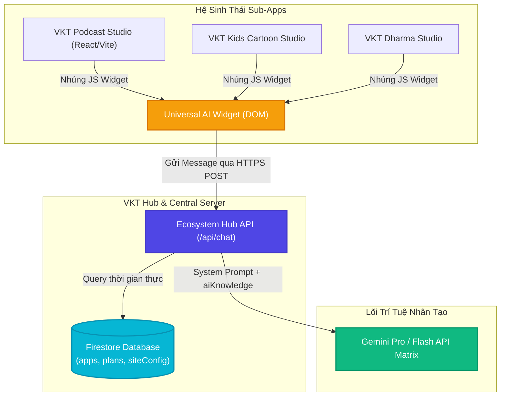

# VKT ECOSYSTEM: CENTRAL AI ASSISTANT INTEGRATION BLUEPRINT
## Bản Thiết Thiết Kế & Hướng Dẫn Tích Hợp Trợ Lý AI Tiêu Chuẩn Hệ Sinh Thái VKT

Hệ thống Trợ lý AI (Central Dynamic AI Assistant) sở hữu khả năng truy vấn dữ liệu huấn luyện động từ Firestore, đồng bộ cờ thanh toán, xưng hô lễ phép 100% ("Em" - "Anh/Chị") và bảo mật tuyệt đối.

Để tích hợp và nâng cấp công nghệ này lên toàn bộ các ứng dụng con trong hệ sinh thái (như `VKT Kids Cartoon`, `VKT Dharma Studio`, `VKT Podcast Studio`...), lập trình viên cần tuân thủ cấu trúc thiết kế tiêu chuẩn dưới đây.

---

## 🗺️ TẦM NHÌN KIẾN TRÚC HỆ THỐNG (SYSTEM ARCHITECTURE)

Dưới đây là sơ đồ luồng dữ liệu và phản hồi thông minh giữa các Sub-App, Hub chính và Gemini API:



---

## 📊 BẢNG SO SÁNH CÁC PHƯƠNG ÁN TÍCH HỢP

| Tiêu chí so sánh | Phương ÁN 1: Universal Widget Script (Khuyên Dùng ⭐️) | Phương ÁN 2: Standalone Component Integration |
| :--- | :--- | :--- |
| **Bản chất kỹ thuật** | Build widget AI tại Hub thành 1 file JS phân phối (`vkt-ai.js`) và nhúng 1 dòng code vào `index.html` của các app con. | Copy component React `AIAssistant.tsx` sang từng app con và kết nối Firestore cục bộ. |
| **Tốc độ tích hợp** | **Cực kỳ nhanh (dưới 5 phút):** Chỉ thêm 1 thẻ `<script>` duy nhất. | **Trung bình (2-3 tiếng):** Cần cấu hình Firebase SDK, tải thư viện Lucide, React Hooks. |
| **Bảo trì & Nâng cấp** | **Vô địch:** Khi Admin chỉnh sửa giao diện, cập nhật prompt ở Hub, tất cả app con tự động cập nhật ngay lập tức. | **Khó khăn:** Mỗi lần nâng cấp giao diện chatbot lại phải sửa code và deploy từng app con một. |
| **Bảo mật API Key** | **Tuyệt đối:** Gọi trực tiếp qua Gateway API `/api/chat` tập trung của Hub. | **Khá:** Mỗi app con phải tự cấu hình Serverless Function để che giấu Gemini API Key. |
| **Tính đồng nhất** | **Hoàn hảo:** Đồng bộ 100% giao diện, màu sắc chủ đạo (`themeColor`), hotline và các quy tắc từ hệ thống Hub. | **Thấp:** Dễ lệch tông màu hoặc cấu hình không đồng bộ nếu dev quên cập nhật. |

---

## 🛠️ HƯỚNG DẪN TRIỂN KHAI CHI TIẾT (STEP-BY-STEP IMPLEMENTATION)

### ⭐️ PHƯƠNG ÁN 1: TÍCH HỢP QUA "UNIVERSAL WIDGET SCRIPT" (ĐỈNH CỦA ĐỈNH)

Đây là giải pháp cấp độ Enterprise. Chúng ta biến chatbot VKT thành một thư viện độc lập phân phối qua CDN hoặc domain Hub chính.

#### Bước 1: Tạo tệp phân phối Widget tại Hub (`VKT_ECOSYSTEM_HUB`)
Chúng ta sử dụng Vite để build `AIAssistant.tsx` thành một thư viện Single JS độc lập.
Tạo file cấu hình build đặc biệt `vite.widget.config.ts` tại thư mục Hub:

```typescript
// vite.widget.config.ts
import { defineConfig } from 'vite';
import react from '@vitejs/plugin-react';
import { resolve } from 'path';

export default defineConfig({
  plugins: [react()],
  build: {
    lib: {
      entry: resolve(__dirname, 'src/widget-entry.tsx'),
      name: 'VKTAIAssistant',
      fileName: () => 'vkt-ai-assistant.js',
      formats: ['umd']
    },
    outDir: 'public/dist',
    rollupOptions: {
      output: {
        assetFileNames: 'vkt-ai-assistant.[ext]'
      }
    }
  }
});
```

Tạo file `src/widget-entry.tsx` để render tự động widget vào DOM của bất kỳ website nào nhúng nó:

```tsx
// src/widget-entry.tsx
import React from 'react';
import ReactDOM from 'react-dom/client';
import { AIAssistant } from './components/AIAssistant';
import { AppProvider } from './context/AppContext';
import './index.css'; // Bundle CSS trực tiếp

const initWidget = () => {
  // Tạo container element tự động ở cuối trang
  const container = document.createElement('div');
  container.id = 'vkt-ai-assistant-root';
  document.body.appendChild(container);

  const root = ReactDOM.createRoot(container);
  root.render(
    <React.StrictMode>
      <AppProvider>
        <AIAssistant />
      </AppProvider>
    </React.StrictMode>
  );
};

if (document.readyState === 'loading') {
  document.addEventListener('DOMContentLoaded', initWidget);
} else {
  initWidget();
}
```

#### Bước 2: Build và Deploy
Chạy lệnh build widget tại Hub:
```bash
npx vite build --config vite.widget.config.ts
```
Khi deploy lên Vercel, tệp JS widget sẽ khả dụng tại: `https://kiemtienvu.com/dist/vkt-ai-assistant.js` (và file CSS tương ứng).

#### Bước 3: Nhúng vào `VKT_PODCAST_STUDIO` và các app khác
Mở file `index.html` của `VKT_PODCAST_STUDIO` (hoặc bất kỳ app con nào khác), dán đoạn mã sau vào trước thẻ đóng `</body>`:

```html
<!-- Nhúng CSS Widget -->
<link rel="stylesheet" href="https://kiemtienvu.com/dist/vkt-ai-assistant.css">

<!-- Nhúng JS Lõi Trợ Lý AI của Hub VKT -->
<script src="https://kiemtienvu.com/dist/vkt-ai-assistant.js" defer></script>
```

---

### PHƯƠNG ÁN 2: TÍCH HỢP DẠNG COMPONENT REACT ĐỘC LẬP (STANDALONE COMPONENT)

#### Bước 1: Đồng bộ cấu trúc Database
Đảm bảo Firestore có một kết nối Firebase SDK trỏ chung đến cùng cơ sở dữ liệu của Hub VKT. 
Trong `src/lib/firebase.ts` của Podcast Studio, kiểm tra cấu hình config của Firebase đảm bảo nó cùng một Project ID với Hub.

#### Bước 2: Sao chép Component
1. Copy file `AIAssistant.tsx` từ Hub sang `src/components/AIAssistant.tsx` của Podcast Studio.
2. Cài đặt các thư viện icons cần thiết nếu chưa có:
   ```bash
   npm install lucide-react
   ```

#### Bước 3: Cấu hình API Endpoint cục bộ tại Sub-App
Nếu Sub-App không muốn gọi chéo API của Hub (CORS), sub-app có thể tự tạo endpoint Serverless Function tại `api/chat.ts` riêng của nó.
Tạo file `api/chat.ts`:

```typescript
import type { VercelRequest, VercelResponse } from '@vercel/node';
// Copy toàn bộ logic chat.ts của Hub sang đây.
// Đảm bảo che giấu GEMINI_API_KEY trong Environment Variables của Vercel dự án con này.
```

#### Bước 4: Nhúng vào giao diện chính
Mở `App.tsx` của Podcast Studio, thực hiện nhúng component:

```tsx
import { AIAssistant } from './components/AIAssistant';

// Tại phần cuối hàm render của App.tsx, dán vào trước thẻ đóng div ngoài cùng:
return (
  <div className="min-h-screen flex flex-col">
    {/* Giao diện hiện tại... */}
    
    <ApiKeyModal isOpen={showConfig} onClose={handleConfigClose} />
    <ToastContainer />
    
    {/* Nhúng Trợ Lý AI dynamic cục bộ */}
    <AIAssistant />
  </div>
);
```

---

## 🎯 ĐỀ XUẤT LỘ TRÌNH TRIỂN KHAI TỐI ƯU NHẤT (RECOMMENDATION)

Em đặc biệt khuyên dùng **Phương án 1 (Universal Widget Script)**. 

Giải pháp này biến toàn bộ các ứng dụng con của chúng ta thành những thực thể siêu nhẹ. Bất kỳ khi nào Anh/Chị muốn mở thêm app mới (ví dụ App thứ 5, thứ 10), Anh/Chị chỉ cần cấu hình mô tả và file huấn luyện `aiKnowledge` trên trang Admin Hub của `kiemtienvu.com`, sau đó nhúng đúng 1 dòng script vào app mới đó. Trợ lý AI sẽ ngay lập tức "học" được tri thức mới và vận hành trơn tru mà không cần code lại hệ thống chatbot thêm một lần nào nữa!
